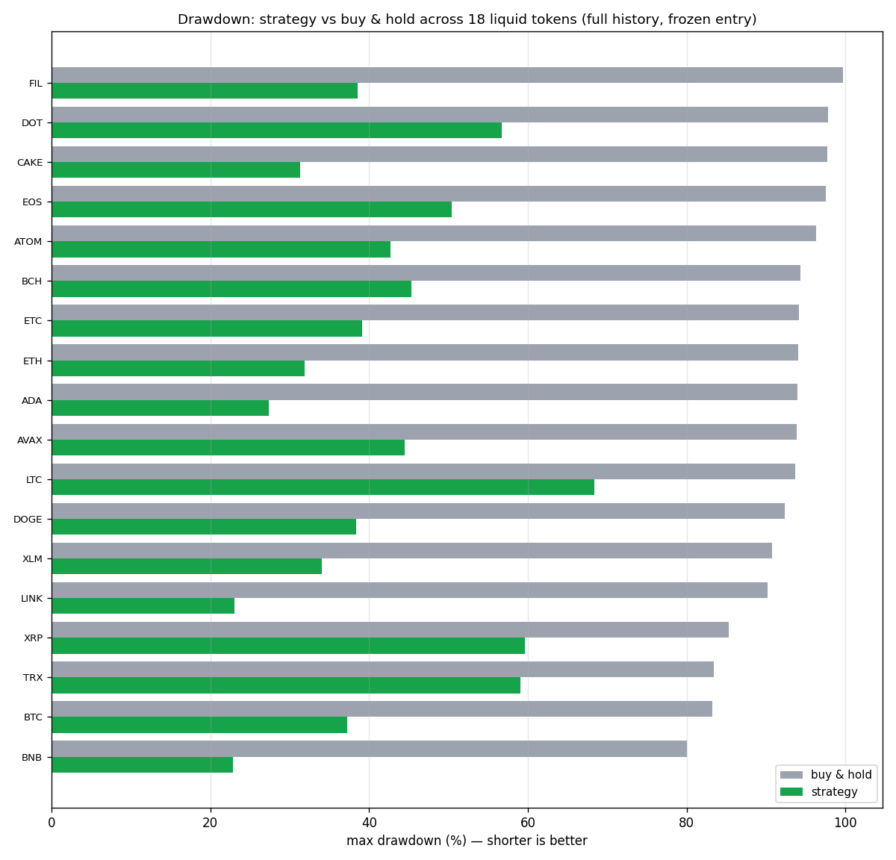
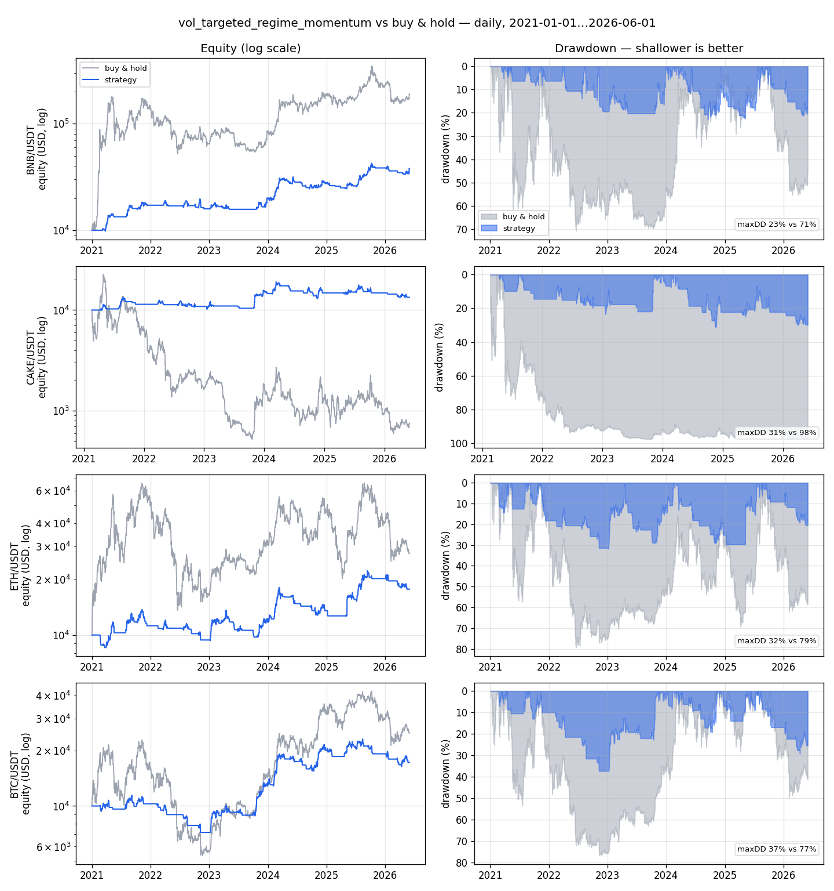
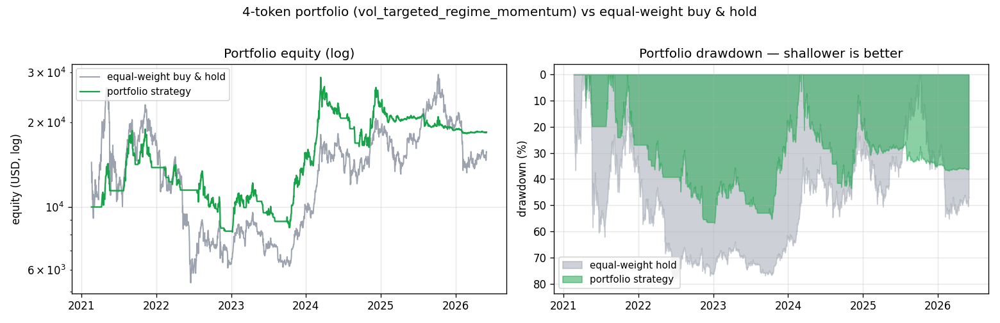
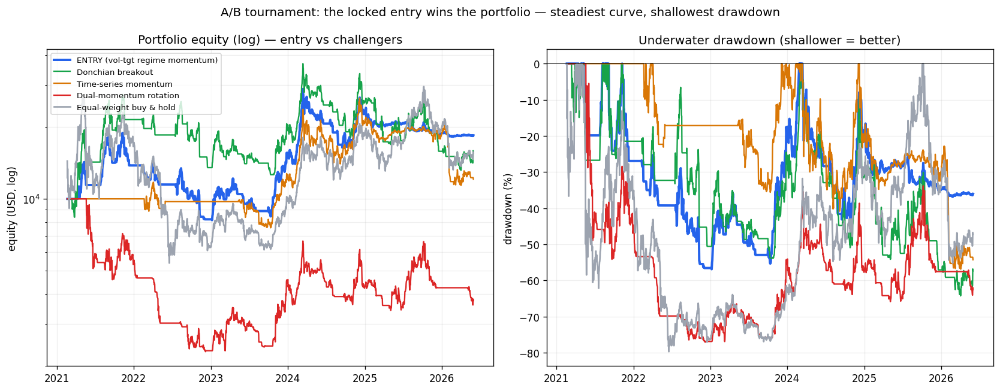

# Cadence — discipline over hype

**BNB HACK — AI Trading Agent · Track 2 (backtestable strategy engine)**

*Repository and Python package: `bnb_bot`.*

> Our edge is not the biggest number. It's a strategy whose backtest you can
> *trust*, that controls drawdown by design, and that proves itself on data it
> was never tuned on.

`bnb_bot` is a strategy engine that generates and backtests trading strategies
on liquid BNB-ecosystem tokens. The shippable entry is **volatility-targeted,
regime-gated momentum**: it rides uptrends, sits in cash during downtrends, and
scales its exposure down when markets get turbulent — cutting drawdown to a
fraction of buy-and-hold while staying profitable.

This milestone is **backtest + report only**. No live trading, no orders, no
keys, no capital at risk.

> **Why that matters for judging.** Track 2 re-runs every submission on a
> **held-out market window after the deadline**. Strategies tuned to look good
> in-sample collapse the moment they meet unseen data — that's the trap. This
> entry is engineered for exactly that test: every number below is out-of-sample,
> cross-validated, or stress-tested, and the parameters were frozen by a
> holdout-validated search, never hand-picked. It's built to *survive the re-run*,
> not to win a screenshot.

---

## Why this entry

The judged axes are **returns, max drawdown, risk-adjusted performance, and rule
adherence**. We built to the last three deliberately. A long-only spot strategy
cannot out-return a crypto bull market — and any strategy that *claims* to is
usually lying to itself through one of the three classic backtest mistakes. So we
made two things our product:

1. **A backtester that cannot lie** (see *Backtest honesty* below).
2. **Disciplined risk control** — a strategy that reliably halves drawdown and
   preserves capital in crashes, validated on a strict out-of-sample holdout.

## The strategy, in plain terms

Three layers, each fixing a real failure we measured in naive baselines:

- **Momentum** — go long when the short-term trend is up (EMA crossover).
- **Regime gate** — *only* hold when price is above its long (50-day) moving
  average. In a sustained downtrend the strategy is flat (in cash), so it never
  fights the tide or "catches falling knives."
- **Volatility targeting** — size the position for a constant *risk* budget, not
  constant capital: lean in when markets are calm, shrink when they're wild.

On top sits a **risk layer**: a per-trade stop-loss and a drawdown breaker that
halts new entries during a deep drawdown.

The exact, frozen parameters live in
[`bnb_bot/presets.py`](bnb_bot/presets.py) (`VOL_TARGETED_REGIME_MOMENTUM`) and
were chosen by a holdout-validated search, not by hand.

## Backtest honesty — the three lies we guard against

This is the core of the product. Each guard is enforced in code and pinned by
tests:

1. **No look-ahead.** A signal at bar *t* sees only data with timestamp ≤ *t*,
   and every fill happens at the *next* bar's open — never the same bar's close.
   Tested by feeding two series that differ only in the future and asserting
   identical past fills.
2. **All costs modelled.** Every simulated fill pays a swap fee + slippage + gas.
   There is no fee-free path through the engine.
3. **No overfitting.** Results are reported on a **walk-forward** basis and on an
   **untouched 25% holdout** the parameter search never saw. Strategy parameters
   are chosen once, across all tokens — never cherry-picked per coin.

If a metric can't be computed honestly, the code raises rather than inventing a
number.

## Headline results

Every fill pays costs; signals are causal; nothing here is in-sample-only. Two
honest views — the **broadest, longest-history test first**, then the **validated
entry on the exact set it was locked on**.

### Broadest test — frozen entry, 18 tokens, full history to 2017

The strongest overfitting check: the *frozen* entry (14 of these 18 tokens were
**never** used to choose its parameters), each run over its **full Binance history
back to 2017** — including the brutal 2018 bear the 2021-start window never saw. It
beat buy-and-hold's **drawdown on 18/18**, cutting max drawdown roughly in **half
on average**, and beat hold's **return on 9 of the 18** — the coins that pumped
then collapsed (FIL +79% vs −99%, ADA +429% vs −3%, EOS −3% vs −94%) — while
trailing on the nine that mostly went up. On the mega-survivors (BTC/ETH/BNB)
holding still out-returns us — nothing long-only-spot beats a coin that only went
up — but it does so at **2–3× our drawdown**. The durable, universal win is
drawdown; the return win is real but asset-dependent.



Detail in [`reports/generalization_summary.md`](reports/generalization_summary.md);
per-asset equity curves in [`docs/performance_all.png`](docs/performance_all.png).

### The validated entry — 4 design tokens, common window 2021 → 2026

This is the universe and window the entry was **searched and locked on**. The
window starts in 2021 for a mechanical reason — **CAKE only listed on Binance in
Feb 2021**, and a four-token portfolio needs all four trading at once (BTC/ETH/BNB
go back to 2017, used in the broader test above). Drawdown and risk-adjusted
**Calmar** are the story:



| Token | Strategy return | B&H return | Strategy maxDD | B&H maxDD | Strategy Calmar | B&H Calmar |
| --- | ---: | ---: | ---: | ---: | ---: | ---: |
| BNB | +279% | +1781% | **23%** | 71% | **1.22** | 1.02 |
| BTC | +73% | +151% | **37%** | 77% | **0.29** | 0.24 |
| ETH | +77% | +175% | **32%** | 79% | **0.35** | 0.26 |
| CAKE | +34% | −92% | **31%** | 98% | **0.18** | −0.40 |

Drawdown is a **third to a half** of buy-and-hold, and the strategy beats hold's
**Calmar — return per unit of drawdown — on all four tokens**: more reward per unit
of risk than holding, even where holding's *raw* return is higher. In a roaring
bull, long-only spot can't out-return holding the winners; we trade that for far
less pain (and a *positive* return even on CAKE, which holders rode down −92%).

**Untouched holdout (most recent 25%, scored once) — the honesty test:**

The strategy beat buy-and-hold's **drawdown on 4/4 tokens** and its **return on
3/4** on data the search never touched. On BNB it returned **+46% vs +2%** at a
**Sharpe of 1.26 vs 0.29**; on ETH **+39% vs −38%** (Sharpe 1.02 vs −0.13). Full
detail in
[`reports/search_cost_robust_summary.md`](reports/search_cost_robust_summary.md).

**Pressure tests (does it survive scrutiny?):** a paired block **bootstrap** of
3,000 resampled histories found the strategy beat hold's drawdown in **95.6%** of
them (even the unlucky 5th-percentile path reduced drawdown) — though the *return*
swung −63% to +823%, confirming the return is uncertain and the drawdown claim is
the robust one. A **regime stress test** (2018 crash, 2019–20 chop, 2021 bull,
2022 bear, 2023–24 recovery) showed drawdown control holds in **every** regime;
return crushes hold in crashes, trails in bulls, ties in chop. See
[`reports/bootstrap_summary.md`](reports/bootstrap_summary.md) and
[`reports/regime_slices_summary.md`](reports/regime_slices_summary.md).

**Traded as a portfolio (what you'd actually run):**



Run across all four tokens on one shared book, the strategy returns **+85% vs an
equal-weight buy-and-hold portfolio's +8%**, at **57% vs 80% max drawdown**, and
beats hold's drawdown in **5 of 5 walk-forward folds**. Two honest caveats: (a)
the portfolio's drawdown (57%) is *higher* than the single-token average (31%) —
these tokens are correlated and the portfolio deploys idle cash, so the win is
capital efficiency vs holding, not diversification; (b) the return is somewhat
**cost-sensitive** (the strategy trades) — it stays positive at 2× our assumed
costs (**+15%**) and goes negative only at 3× (−18%), while the **drawdown control
survives at every cost level**. (This is after deliberately re-tuning turnover
down to harden it — see `FINDINGS.md` Stage 7.) Detail in
[`reports/portfolio_summary.md`](reports/portfolio_summary.md) and
[`reports/robustness_summary.md`](reports/robustness_summary.md).

## Tested against competition (A/B)

We didn't just polish our own entry — we ran it against three respected
challengers on the **identical honest rig** (same costs, risk, no look-ahead,
parameters by convention): a **Donchian breakout**, **time-series momentum**, and
a **dual-momentum rotation**. Traded as a portfolio, **the entry won outright** —
best return, drawdown, *and* Calmar; the flashy rotation blew up (−63%, exactly the
overfitting/cost-fragility the literature warns of). On the recent holdout its
drawdown was a third of every challenger's.



Per *individual* token the challengers can capture more of a single strong trend
(a breakout rode BNB further), but they bleed on the weak assets — which is why
they lose at the portfolio level, where our per-asset risk control smooths the
book. We even chased the one improvement the A/B suggested (a slower
"let-winners-run" exit) through the full validation gauntlet — it came out a
**wash**, so we adopted nothing and left the entry frozen. Detail:
[`reports/ab_challengers_summary.md`](reports/ab_challengers_summary.md),
[`FINDINGS.md`](FINDINGS.md) Stages 12–13.

## Packaged as a CMC Skill

The strategy ships as a **CMC Skill** — the lightweight, folder-based format from
[CoinMarketCap's official skills repo](https://github.com/coinmarketcap-official/skills-for-ai-agents-by-CoinMarketCap):
a `SKILL.md` workflow doc an AI agent reads to operate the strategy. This is the
Track 2 deliverable ("Skills that generate backtestable trading strategies from
market data") and satisfies the hackathon's sponsor-capability requirement.

- **[`skills/risk-controlled-momentum/SKILL.md`](skills/risk-controlled-momentum/SKILL.md)** —
  the skill: when to use it, the honesty guards, and the step-by-step workflow.
- **[`STRATEGY-SPEC.md`](STRATEGY-SPEC.md)** — the formal, self-contained
  backtestable spec (precise enough to re-implement or re-run on a held-out
  window after submission lock).

Unlike CoinMarketCap's example skills (data-access references for the CMC API),
this is a *strategy* skill.

**Live CMC data.** `scripts/live_context.py` pulls live CoinMarketCap signals
(Fear & Greed index + BTC dominance, free tier) and shows the strategy's current
stance. We also *backtested* gating the strategy on CMC's Fear & Greed and found
it does **not** improve risk-adjusted performance (`reports/fear_greed_summary.md`)
— so we use F&G as honest **market context, not a trade trigger**. Testing a
sponsor's signal and reporting that it didn't help is the same discipline the rest
of the entry is built on.

## Reproduce it

```bash
python3 -m venv venv && ./venv/bin/pip install -r requirements.txt

# Reproduce the headline entry result (fetches free Binance history via ccxt):
./venv/bin/python scripts/run_entry.py        # -> reports/entry_summary.md

# Re-run the holdout-validated search that picked the locked entry:
./venv/bin/python scripts/search_cost_robust.py   # -> reports/search_cost_robust_summary.md

# Stress tests: cost sensitivity + out-of-universe generalization:
./venv/bin/python scripts/run_robustness.py   # -> reports/robustness_summary.md

# Run any single strategy/token/window and get a report + equity/drawdown plot:
./venv/bin/python scripts/run_backtest.py --symbol BNB/USDT \
    --start 2022-01-01 --end 2025-01-01 --strategy momentum --risk

# Tests (the backtest's credibility lives here):
./venv/bin/python -m pytest -q
```

Historical OHLCV comes from `ccxt` (Binance spot, free, no key) cached as
parquet under `data/` (gitignored).

## Repository layout

```
bnb_bot/
  config.py       cost model + risk limits (range-validated)
  types.py        core dataclasses (Candle, Signal, Fill, Position, ...)
  data.py         ccxt OHLCV loader + parquet cache + fail-loud gap detection
  backtest.py     event-driven engine: no-lookahead, costs on every fill
  strategy.py     Momentum, MeanReversion, TrendFollowing, DonchianBreakout,
                  TimeSeriesMomentum + RegimeGated / VolatilityTargeted /
                  FearGreedGated / StickyExit composable wrappers
  rotation.py     cross-asset allocators (dual-momentum rotation challenger)
  sentiment.py    CMC + alternative.me Fear & Greed loader (no-lookahead lookup)
  risk.py         stop-loss, position/exposure caps, drawdown breaker
  metrics.py      return, drawdown, Sharpe, Sortino, Calmar, win rate, exposure
  walkforward.py  buy-and-hold benchmark + walk-forward evaluation
  portfolio.py    shared-book engine: per-symbol + cross-asset rotation allocators
  report.py       markdown report + equity/drawdown plot
  presets.py      the frozen, validated submission entry
scripts/          run_entry · run_portfolio · run_ab_challengers · live_context · …
tests/            131 tests pinning the engine, metrics, risk, and strategies
skills/           the CMC Skill packaging (risk-controlled-momentum/SKILL.md)
STRATEGY-SPEC.md  the formal, self-contained backtestable spec
```

## Honest limitations

- **Costs are modelled, not measured on-venue.** We charge PancakeSwap-style
  fees on Binance price data; real on-chain slippage would differ (and is size-
  dependent). We stress-tested this and re-tuned turnover down to harden it: the
  **drawdown control is robust** (holds at 3× costs) and the portfolio return now
  **stays positive at 2× assumed costs (+15%)**, going negative only at 3×.
  Still, treat the headline return as cost-dependent; the risk-control story is
  the more durable claim.
- **Long-only spot.** In a strong, steady bull market, buy-and-hold out-returns
  us — we trade upside for much lower drawdown. That trade-off is the point.
- **One historical path.** 2021–2026 is a single sequence of regimes. The
  holdout and cross-token validation make the result credible, not guaranteed.

## Status & scope

Backtest + report only. The Trust Wallet / BNB Chain execution layer is a later,
operator-gated concern; until then this repo moves no money and performs no
irreversible action. See [`FINDINGS.md`](FINDINGS.md) for the full research
narrative — including the dead-ends — and [`PLAN.md`](PLAN.md) for the build log.
