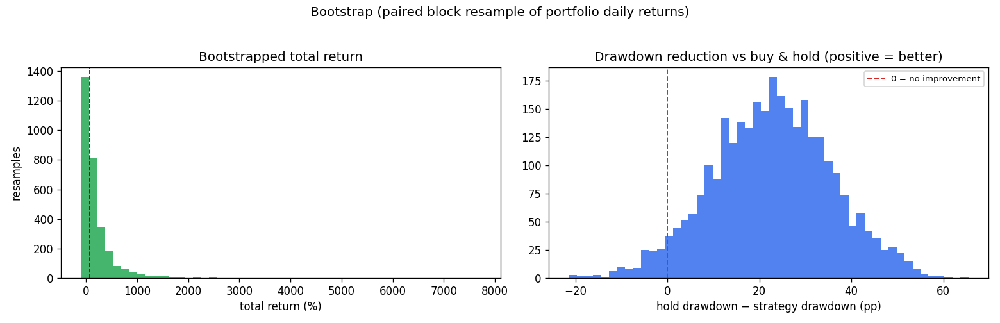

# Bootstrap summary — confidence bands on the portfolio result

Paired stationary block bootstrap (block 21 days, 3000 resamples, seed 20260603) of the 4-token portfolio's 1927 daily returns vs equal-weight buy-and-hold, 2021-01-01→2026-06-01. The same resampled calendar is applied to both, so each alternate history is a fair fight.

**In 95.6% of 3000 alternate histories the strategy's max drawdown was smaller than buy-and-hold's.**

| Metric | Median | 5th pct | 95th pct |
| --- | ---: | ---: | ---: |
| Total return | 80.2% | -63.1% | 822.7% |
| Max drawdown | 55.9% | 36.2% | 80.0% |
| Sharpe (ann.) | 0.49 | -0.36 | 1.32 |
| Drawdown reduction vs hold | 22.9% | 1.0% | 44.5% |

Caveat: a return bootstrap measures *path/sampling* variability of the realized return stream; it cannot capture regime risk the strategy never encountered. See the regime-slice stress test for that.
