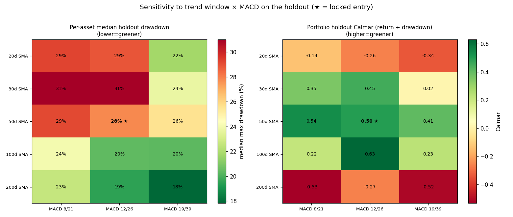

# Parameter sensitivity sweep (holdout)

Trend window × MACD setting, all other knobs at the locked entry, scored on the untouched last-25% holdout. **Read as a sensitivity map, not a re-selection** — choosing the best-on-holdout config would overfit the holdout.

## Per asset — median across 18 tokens (holdout)

| Trend | MACD | Median DD | Median return | DD beats hold |
| --- | --- | ---: | ---: | ---: |
| 20d | 8/21 | 29% | -7% | 18/18 |
| 20d | 12/26 | 29% | -4% | 18/18 |
| 20d | 19/39 | 22% | 1% | 18/18 |
| 30d | 8/21 | 31% | -7% | 18/18 |
| 30d | 12/26 | 31% | -5% | 18/18 |
| 30d | 19/39 | 24% | -3% | 18/18 |
| 50d | 8/21 | 29% | -8% | 18/18 |
| 50d **(locked)** | 12/26 | 28% | -3% | 18/18 |
| 50d | 19/39 | 26% | -5% | 18/18 |
| 100d | 8/21 | 24% | -6% | 18/18 |
| 100d | 12/26 | 20% | 2% | 18/18 |
| 100d | 19/39 | 20% | 4% | 18/18 |
| 200d | 8/21 | 23% | -10% | 18/18 |
| 200d | 12/26 | 19% | -5% | 18/18 |
| 200d | 19/39 | 18% | -4% | 18/18 |

## 4-token portfolio (holdout; buy & hold: return -7%, drawdown 61%)

| Trend | MACD | Return | MaxDD | Sharpe | Calmar |
| --- | --- | ---: | ---: | ---: | ---: |
| 20d | 8/21 | -5% | 26% | 0.05 | -0.14 |
| 20d | 12/26 | -10% | 29% | -0.09 | -0.26 |
| 20d | 19/39 | -11% | 24% | -0.15 | -0.34 |
| 30d | 8/21 | 13% | 27% | 0.43 | 0.35 |
| 30d | 12/26 | 14% | 23% | 0.47 | 0.45 |
| 30d | 19/39 | 1% | 26% | 0.16 | 0.02 |
| 50d | 8/21 | 18% | 25% | 0.55 | 0.54 |
| 50d **(locked)** | 12/26 | 21% | 32% | 0.60 | 0.50 |
| 50d | 19/39 | 15% | 27% | 0.48 | 0.41 |
| 100d | 8/21 | 7% | 23% | 0.32 | 0.22 |
| 100d | 12/26 | 18% | 21% | 0.59 | 0.63 |
| 100d | 19/39 | 9% | 29% | 0.37 | 0.23 |
| 200d | 8/21 | -10% | 15% | -0.36 | -0.53 |
| 200d | 12/26 | -8% | 23% | -0.18 | -0.27 |
| 200d | 19/39 | -20% | 31% | -0.69 | -0.52 |
