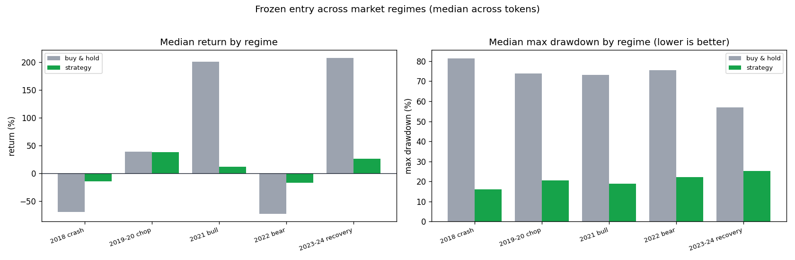

# Regime stress slices — the entry across different market types

Frozen entry vs buy-and-hold across distinct regimes, median across the deep-history tokens available in each slice. The **2019–20 chop** is the hardest case for a trend strategy (no sustained direction to ride).

| Regime | Tokens | Strat return | Hold return | Strat MaxDD | Hold MaxDD | DD beaten |
| --- | ---: | ---: | ---: | ---: | ---: | ---: |
| 2018 crash | 10 | -14.6% | -69.6% | 16.2% | 81.4% | 10/10 |
| 2019-20 chop | 14 | 37.9% | 38.7% | 20.5% | 74.0% | 14/14 |
| 2021 bull | 18 | 11.5% | 201.0% | 18.9% | 73.1% | 18/18 |
| 2022 bear | 18 | -17.5% | -73.3% | 22.1% | 75.4% | 17/18 |
| 2023-24 recovery | 18 | 26.0% | 207.5% | 25.2% | 56.9% | 18/18 |

Read it honestly: drawdown control should hold even in chop (it sits in cash), but *return* is where chop hurts — the strategy gives up the most, relative to its trending-market results, when there's no trend to capture.
